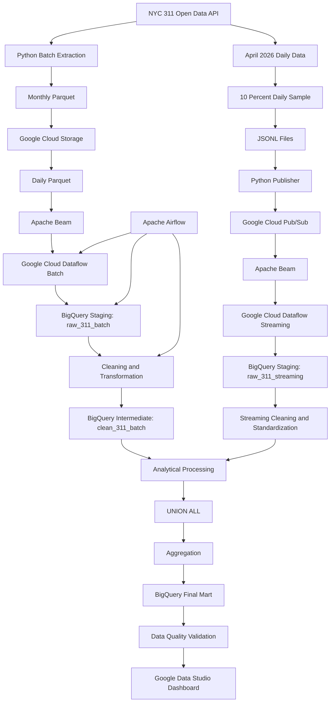

# NYC 311 Batch & Streaming Analytics Pipeline

**Final Project — Data Engineering (JCDEAH-009)**  
**Author:** Ni Nyoman Kayika Manuhita

---

## 1. Project Overview

This project builds an end-to-end Data Engineering pipeline for **NYC 311 Service Requests** using both Batch and simulated Streaming processing.

The pipeline processes NYC 311 data from the NYC Open Data API using Google Cloud services, performs data quality validation, creates analytical BigQuery marts, and presents the final results through a Google Data Studio dashboard.

The final analysis focuses on:

- Total service requests
- Top complaint types
- Service requests by borough
- Agency workload
- Request status distribution
- Average resolution time
- Daily service request trend

---

## 2. Data Source

**Source:** NYC 311 Service Requests from NYC Open Data

**Dataset ID:**

```text
erm2-nwe9
```

**API Endpoint:**

```text
https://data.cityofnewyork.us/resource/erm2-nwe9.json
```

### Data Period

| Pipeline | Period | Data Usage |
|---|---|---:|
| Batch | January 2026 – March 2026 | 100% |
| Streaming | April 2026 | 10% sample from each day |

### Final Data Volume

| Source | Rows |
|---|---:|
| Batch | 1,025,589 |
| Streaming Sample | 30,220 |
| **Combined Analytical Total** | **1,055,809** |

Batch data represents historical data, while Streaming data is used to simulate real-time event ingestion.

---

## 3. Architecture



### Main Design

The project contains two pipelines:

**Batch Pipeline**

```text
NYC 311 API
→ Python Extraction
→ Monthly Parquet
→ Google Cloud Storage
→ Daily Parquet
→ Apache Beam
→ Dataflow Batch
→ BigQuery Staging
→ BigQuery Intermediate
```

**Streaming Pipeline**

```text
NYC 311 API
→ 10% Daily Sample
→ JSONL
→ Python Publisher
→ Pub/Sub
→ Dataflow Streaming
→ BigQuery Staging
```

**Analytical Processing**

```text
Batch Intermediate
+
Streaming Staging
→ Streaming Cleaning & Standardization
→ UNION ALL
→ Aggregation
→ Final BigQuery Mart
→ Dashboard
```

Streaming intentionally stops at BigQuery Staging. There is no persistent `clean_311_streaming` table.

---

## 4. Technology Stack

This project uses:

- Python
- Pandas
- PyArrow
- Parquet
- Google Cloud Storage
- Google Cloud Pub/Sub
- Apache Beam
- Google Cloud Dataflow
- Google BigQuery
- Apache Airflow
- Docker
- Docker Compose
- PostgreSQL
- Google Data Studio
- SQL
- Bash

### Cloud Configuration

```text
GCP Project : jcdeah-009
Region      : asia-southeast2
```

---

## 5. Selected Source Columns

The pipeline uses 13 required columns from NYC 311:

```text
unique_key
created_date
closed_date
agency
agency_name
complaint_type
descriptor
status
borough
incident_zip
latitude
longitude
resolution_description
```

Target data types:

| Column | Type |
|---|---|
| unique_key | STRING |
| created_date | TIMESTAMP |
| closed_date | TIMESTAMP |
| agency | STRING |
| agency_name | STRING |
| complaint_type | STRING |
| descriptor | STRING |
| status | STRING |
| borough | STRING |
| incident_zip | STRING |
| latitude | FLOAT64 |
| longitude | FLOAT64 |
| resolution_description | STRING |

---

## 6. Batch Pipeline

The Batch Pipeline processes **100% historical NYC 311 data from January through March 2026**.

### Flow

```text
NYC 311 API
↓
Python Extraction
↓
Monthly Parquet
↓
Google Cloud Storage
↓
Daily Parquet
↓
Apache Beam
↓
Google Cloud Dataflow
↓
BigQuery Staging
raw_311_batch
↓
Cleaning & Transformation
↓
BigQuery Intermediate
clean_311_batch
↓
Data Quality Validation
```

### Batch Data Volume

| Month | Rows |
|---|---:|
| January 2026 | 348,511 |
| February 2026 | 334,690 |
| March 2026 | 342,388 |
| **Total** | **1,025,589** |

### Batch Staging Table

```text
jcdeah-009.nyc311_finpro_hita_staging.raw_311_batch
```

### Batch Intermediate Table

```text
jcdeah-009.nyc311_finpro_hita_intermediate.clean_311_batch
```

### Main Batch Scripts

```text
scripts/batch/validate_nyc311_api.py
scripts/batch/profile_nyc311_data.py
scripts/batch/validate_required_columns.py
scripts/batch/extract_nyc311_batch.py
scripts/batch/validate_batch_extraction.py
scripts/batch/split_batch_daily.py
scripts/batch/dataflow_gcs_to_bq.py
```

---

## 7. Google Cloud Storage

Batch extraction initially produces monthly Parquet files.

```text
data/batch/monthly/
```

The files are uploaded to Google Cloud Storage and then split into daily Parquet files.

### GCS Bucket

```text
gs://jcdeah-009-nyc311-final-project-hita
```

### Raw Batch Structure

```text
raw/batch/
├── monthly/
└── daily/
    ├── 2026_01/
    ├── 2026_02/
    └── 2026_03/
```

Daily Parquet files are used as input for the Dataflow Batch Pipeline.

---

## 8. Dataflow Batch Processing

Apache Beam is used to process daily Parquet files, while Google Cloud Dataflow executes the pipeline.

### Input

```text
gs://jcdeah-009-nyc311-final-project-hita/raw/batch/daily/*/*.parquet
```

### Output

```text
jcdeah-009:nyc311_finpro_hita_staging.raw_311_batch
```

### Region

```text
asia-southeast2
```

### Worker Zone

```text
asia-southeast2-b
```

---

## 9. Batch Cleaning & Transformation

Data from BigQuery Staging is cleaned and transformed into:

```text
nyc311_finpro_hita_intermediate.clean_311_batch
```

The transformation includes:

- String trimming
- Case standardization
- Complaint type normalization
- Date derivation
- Resolution time calculation
- Invalid value handling
- Data type validation
- Critical field validation

Complaint type normalization uses:

```sql
NULLIF(LOWER(TRIM(complaint_type)), '')
```

---

## 10. Apache Airflow Orchestration

Apache Airflow is used to orchestrate the **Batch Pipeline**.

Airflow is intentionally limited to the Batch workflow because the Final Mart requires both Batch and Streaming data.

### Final Batch DAG Flow

```text
run_dataflow_batch
↓
validate_staging
↓
transform_intermediate
↓
validate_intermediate
```

The Final Marts are created separately after Streaming data is available.

### Airflow Configuration

```text
Airflow Version : 3.3.1
Python Image    : Python 3.12
Executor        : LocalExecutor
Metadata DB     : PostgreSQL 16
DAG ID          : nyc311_batch_pipeline
Timezone        : Asia/Jakarta
Schedule        : 0 2 1 * *
Catchup         : False
Retries         : 1
Retry Delay     : 5 minutes
```

The schedule:

```text
0 2 1 * *
```

means the Batch DAG is scheduled monthly on the first day of the month at 02:00.

### Airflow Docker Environment

```text
Docker
↓
Docker Compose
↓
Apache Airflow
+
PostgreSQL Metadata Database
```

### Failure Monitoring

Airflow uses an SMTP failure callback.

```text
Task Failed
↓
Airflow Failure Callback
↓
SMTP
↓
Email Notification
```

The failure alert was tested using a temporary DAG that intentionally failed.

The test confirmed that the email notification contained:

- DAG ID
- Task ID
- Run ID

Credentials and application passwords are not stored in this repository.

---

## 11. Streaming Pipeline

The Streaming Pipeline simulates near real-time ingestion using **10% of NYC 311 data from each day during April 2026**.

### Flow

```text
NYC 311 API
↓
Daily April Data
↓
10% Sample per Day
↓
JSONL Files
↓
Python Publisher
↓
Pub/Sub Schema
↓
Pub/Sub Topic
↓
Pub/Sub Subscription
↓
Apache Beam
↓
Google Cloud Dataflow Streaming
↓
BigQuery Staging
raw_311_streaming
```

### Streaming Sample

```text
Total Files  : 30 JSONL files
Total Events : 30,220
Period       : April 2026
```

Streaming validation confirmed:

- 30 JSONL files
- 30,220 rows
- 13 required columns
- April 2026 date range only
- 0 duplicate `unique_key`
- 0 NULL values in critical columns

### Main Streaming Scripts

```text
scripts/streaming/prepare_streaming_sample.py
scripts/streaming/validate_streaming_sample.py
scripts/streaming/publish_streaming_events.py
scripts/streaming/dataflow_pubsub_to_bq.py
```

---

## 12. Google Cloud Pub/Sub

Pub/Sub is used as the message broker for simulated Streaming ingestion.

### Topic

```text
nyc311-streaming-topic
```

### Subscription

```text
nyc311-streaming-sub
```

### Streaming Flow

```text
Python Publisher
↓
JSON Event
↓
Pub/Sub Topic
↓
Pub/Sub Subscription
↓
Dataflow Streaming
```

Each JSONL line is published as an individual JSON event.

---

## 13. Dataflow Streaming

Dataflow Streaming continuously reads events from the Pub/Sub Subscription and writes them into BigQuery Staging.

### Source

```text
projects/jcdeah-009/subscriptions/nyc311-streaming-sub
```

### Destination

```text
jcdeah-009:nyc311_finpro_hita_staging.raw_311_streaming
```

### Job Name

```text
nyc311-finpro-hita-streaming
```

### Actual Simulated Streaming

```text
30 JSONL files
↓
30,220 JSON Events
↓
Pub/Sub
↓
Dataflow Streaming
↓
BigQuery Staging
```

After validation was completed, the Streaming Dataflow job was safely drained.

---

## 14. BigQuery Layers

### Staging Layer

```text
nyc311_finpro_hita_staging.raw_311_batch
nyc311_finpro_hita_staging.raw_311_streaming
```

### Intermediate Layer

```text
nyc311_finpro_hita_intermediate.clean_311_batch
```

The Streaming Pipeline does not create an Intermediate table.

Streaming cleaning and standardization are performed during Analytical Processing.

### Mart Layer

```text
nyc311_finpro_hita_mart.mart_complaint_summary
nyc311_finpro_hita_mart.mart_borough_summary
nyc311_finpro_hita_mart.mart_agency_performance
nyc311_finpro_hita_mart.mart_daily_trend
nyc311_finpro_hita_mart.mart_status_summary
```

---

## 15. Analytical Processing

Analytical processing combines:

```text
Batch:
nyc311_finpro_hita_intermediate.clean_311_batch

Streaming:
nyc311_finpro_hita_staging.raw_311_streaming
```

### Flow

```text
Batch Intermediate
        ↓
        ┐
        │
        ├── Combine Batch + Streaming
        │
        ┘
        ↑
Streaming Staging
↓
Streaming Cleaning & Standardization
↓
UNION ALL
↓
Aggregation
↓
Final BigQuery Mart
↓
Data Quality Validation
↓
Dashboard
```

Streaming data is cleaned inline before being combined with the Batch data.

The process standardizes fields such as:

- complaint type
- borough
- agency
- status
- resolution time

---

## 16. Final BigQuery Marts

### Complaint Summary

```text
mart_complaint_summary
```

Used for:

- Total Service Requests
- Top Complaint Types
- Closed Requests
- Open Requests
- Average Resolution Time

### Borough Summary

```text
mart_borough_summary
```

Used for:

- Service Requests by Borough

### Agency Performance

```text
mart_agency_performance
```

Used for:

- Agency Workload
- Average Resolution Time by Agency

### Daily Trend

```text
mart_daily_trend
```

Used for:

- Daily Service Request Trend
- Daily Open Requests
- Daily Closed Requests
- Average Daily Resolution Time

### Status Summary

```text
mart_status_summary
```

Used for the request status distribution:

```text
CLOSED
OPEN
OTHER
```

---

## 17. Data Quality Validation

Data Quality checks are performed throughout the project.

Checks include:

- API validation
- Required column validation
- Schema validation
- Row count validation
- Date range validation
- Duplicate validation
- Critical NULL validation
- Invalid value validation
- Final Mart consistency validation

### Final Mart Validation

| Validation | Result |
|---|---:|
| Batch Rows | 1,025,589 |
| Streaming Rows | 30,220 |
| Combined Total | 1,055,809 |
| Complaint Mart Total | 1,055,809 |
| Borough Mart Total | 1,055,809 |
| Agency Mart Total | 1,055,809 |
| Daily Trend Total | 1,055,809 |
| Duplicate Complaint Type | 0 |
| Duplicate Borough | 0 |
| Duplicate Agency | 0 |
| Duplicate Date | 0 |
| Invalid Complaint Metrics | 0 |
| Invalid Borough Metrics | 0 |
| Invalid Agency Metrics | 0 |
| Invalid Daily Metrics | 0 |
| Daily Trend Days | 120 |

### Daily Trend Date Range

```text
Minimum Date : 2026-01-01
Maximum Date : 2026-04-30
Total Days   : 120
```

Final validation status:

```text
FINAL MART VALIDATION SUCCESS
```

---

## 18. Request Status Distribution

A separate Mart is used to reshape request status into a structure suitable for the Donut Chart.

### Result

| Status | Total Requests |
|---|---:|
| CLOSED | 1,019,560 |
| OPEN | 15,192 |
| OTHER | 21,057 |
| **Total** | **1,055,809** |

The `OTHER` category represents service requests whose status is not `OPEN` or `CLOSED`.

---

## 19. Dashboard

Final BigQuery Marts are connected to Google Data Studio through the BigQuery Connector.

### Dashboard Name

```text
NYC 311 Analytics Dashboard - Kayika Manuhita
```

### Page 1 — NYC 311 Overview

Contains:

1. Total Service Requests
2. Top Complaint Types
3. Service Requests by Borough
4. Service Requests by Agency
5. Request Status Distribution

### Page 2 — Performance & Trend

Contains:

1. Average Resolution Time by Agency
2. Daily Service Request Trend

### Dashboard Visualizations

#### Total Service Requests

```text
Visual      : Scorecard
Metric      : total_requests
Expected    : 1,055,809
```

#### Top Complaint Types

```text
Visual      : Horizontal Bar Chart
Dimension   : complaint_type
Metric      : total_requests
Display     : Top 10
Sort        : Descending
```

#### Service Requests by Borough

```text
Visual      : Horizontal Bar Chart
Dimension   : borough
Metric      : total_requests
```

#### Service Requests by Agency

```text
Visual      : Horizontal Bar Chart
Dimension   : agency
Metric      : total_requests
Display     : Top 10
```

#### Request Status Distribution

```text
Visual      : Donut Chart
Dimension   : status
Metric      : total_requests
```

#### Average Resolution Time by Agency

```text
Visual      : Horizontal Bar Chart
Dimension   : agency
Metric      : avg_resolution_time_hours
Display     : Top 10
```

#### Daily Service Request Trend

```text
Visual      : Time Series
Dimension   : created_date
Metric      : total_requests
```

### Important Dashboard Note

January through March 2026 use **100% Batch Data**.

April 2026 uses only a **10% daily Streaming sample**.

Therefore, the April daily request volume appears significantly lower than January through March.

The April values should not be interpreted as full-volume April service requests.

### Dashboard Validation

The Dashboard validation confirms:

- Total Service Requests = 1,055,809
- All required visualizations are available
- Final BigQuery Marts are used as data sources
- No unintended filters are active
- Cross-filtering is disabled
- Charts display without errors
- Dashboard works in View Mode

Final status:

```text
DASHBOARD VALIDATION SUCCESS
```

---

## 20. Project Structure

```text
nyc311-final-project/
│
├── dags/
│   └── nyc311_batch_pipeline.py
│
├── data/
│   ├── batch/
│   │   ├── monthly/
│   │   └── daily/
│   │
│   └── stream/
│       └── sample/
│
├── docs/
│   └── screenshots/
│
├── logs/
├── plugins/
├── config/
│
├── schemas/
│   ├── nyc311_streaming.proto
│   └── nyc311_streaming_bq_schema.json
│
├── scripts/
│   ├── batch/
│   │   ├── validate_nyc311_api.py
│   │   ├── profile_nyc311_data.py
│   │   ├── validate_required_columns.py
│   │   ├── extract_nyc311_batch.py
│   │   ├── validate_batch_extraction.py
│   │   ├── split_batch_daily.py
│   │   └── dataflow_gcs_to_bq.py
│   │
│   └── streaming/
│       ├── prepare_streaming_sample.py
│       ├── validate_streaming_sample.py
│       ├── publish_streaming_events.py
│       └── dataflow_pubsub_to_bq.py
│
├── sql/
│   ├── staging/
│   │   └── assert_raw_311_batch.sql
│   │
│   ├── intermediate/
│   │   ├── create_clean_311_batch.sql
│   │   └── assert_clean_311_batch.sql
│   │
│   └── mart/
│       ├── create_mart_complaint_summary.sql
│       ├── create_mart_borough_summary.sql
│       ├── create_mart_agency_performance.sql
│       ├── create_mart_daily_trend.sql
│       ├── create_mart_status_summary.sql
│       └── validate_mart.sql
│
├── Dockerfile
├── docker-compose.yaml
├── requirements.txt
├── requirements-airflow.txt
└── README.md
```

---

## 21. Local Setup

### Activate Python Environment

The project was developed using a local Python environment.

Example:

```bash
source ~/cleanenv/bin/activate
```

Install dependencies:

```bash
pip install -r requirements.txt
```

### Configure Google Cloud Project

```bash
gcloud config set project jcdeah-009
```

Check:

```bash
gcloud config get-value project
```

Authenticate Application Default Credentials if required:

```bash
gcloud auth application-default login
```

---

## 22. Run Batch Pipeline

### Validate NYC 311 API

```bash
python scripts/batch/validate_nyc311_api.py
```

### Initial Data Profiling

```bash
python scripts/batch/profile_nyc311_data.py
```

### Validate Required Columns

```bash
python scripts/batch/validate_required_columns.py
```

### Extract Batch Data

```bash
python scripts/batch/extract_nyc311_batch.py
```

### Validate Batch Extraction

```bash
python scripts/batch/validate_batch_extraction.py
```

### Split Monthly Data into Daily Parquet

```bash
python scripts/batch/split_batch_daily.py
```

### Run Dataflow Batch

```bash
python scripts/batch/dataflow_gcs_to_bq.py \
  --runner=DataflowRunner \
  --project=jcdeah-009 \
  --region=asia-southeast2 \
  --worker_zone=asia-southeast2-b \
  --job_name="nyc311-finpro-hita-batch" \
  --temp_location=gs://jcdeah-009-nyc311-final-project-hita/temp/dataflow/ \
  --staging_location=gs://jcdeah-009-nyc311-final-project-hita/staging/dataflow/ \
  --input="gs://jcdeah-009-nyc311-final-project-hita/raw/batch/daily/*/*.parquet" \
  --output_table="jcdeah-009:nyc311_finpro_hita_staging.raw_311_batch" \
  --bq_temp_location="gs://jcdeah-009-nyc311-final-project-hita/temp/dataflow/bq/"
```

---

## 23. Run Apache Airflow

Build the container:

```bash
docker compose build
```

Start Airflow:

```bash
docker compose up -d
```

Check containers:

```bash
docker compose ps
```

Airflow UI:

```text
http://localhost:8080
```

The Batch DAG can also be triggered manually:

```bash
docker compose exec airflow \
  airflow dags trigger nyc311_batch_pipeline
```

---

## 24. Run Streaming Pipeline

### Prepare Streaming Sample

```bash
python scripts/streaming/prepare_streaming_sample.py
```

### Validate Streaming Sample

```bash
python scripts/streaming/validate_streaming_sample.py
```

### Start Dataflow Streaming

```bash
python scripts/streaming/dataflow_pubsub_to_bq.py \
  --runner=DataflowRunner \
  --project=jcdeah-009 \
  --region=asia-southeast2 \
  --job_name=nyc311-finpro-hita-streaming \
  --temp_location=gs://jcdeah-009-nyc311-final-project-hita/temp/dataflow/ \
  --staging_location=gs://jcdeah-009-nyc311-final-project-hita/staging/dataflow/ \
  --subscription=projects/jcdeah-009/subscriptions/nyc311-streaming-sub \
  --output_table=jcdeah-009:nyc311_finpro_hita_staging.raw_311_streaming
```

### Publish Simulated Streaming Events

```bash
python scripts/streaming/publish_streaming_events.py \
  --delay=0.05
```

Expected:

```text
Total published : 30,220
```

---

## 25. Build Final BigQuery Marts

Create Complaint Mart:

```bash
bq --location=asia-southeast2 query \
  --use_legacy_sql=false \
  < sql/mart/create_mart_complaint_summary.sql
```

Create Borough Mart:

```bash
bq --location=asia-southeast2 query \
  --use_legacy_sql=false \
  < sql/mart/create_mart_borough_summary.sql
```

Create Agency Mart:

```bash
bq --location=asia-southeast2 query \
  --use_legacy_sql=false \
  < sql/mart/create_mart_agency_performance.sql
```

Create Daily Trend Mart:

```bash
bq --location=asia-southeast2 query \
  --use_legacy_sql=false \
  < sql/mart/create_mart_daily_trend.sql
```

Create Status Summary Mart:

```bash
bq --location=asia-southeast2 query \
  --use_legacy_sql=false \
  < sql/mart/create_mart_status_summary.sql
```

Validate Final Mart:

```bash
bq --location=asia-southeast2 query \
  --use_legacy_sql=false \
  < sql/mart/validate_mart.sql
```

---

## 26. Security Notes

Do not commit credentials or secrets to GitHub.

Files and credentials that should not be committed include:

- Google Cloud credential files
- Gmail / SMTP App Password
- Local `.env`
- Airflow secret configuration
- Generated logs
- Large raw data files
- Temporary files
- Python cache files

Authentication should use:

- Google Cloud Application Default Credentials
- Airflow Connections
- Environment variables

Never hard-code passwords or secret keys inside the repository.

---

## 27. Final Validation Result

Final analytical data:

```text
Batch Data     : 1,025,589
Streaming Data :    30,220
--------------------------------
Total          : 1,055,809
```

Final Mart validation:

```text
FINAL MART VALIDATION SUCCESS
```

Dashboard validation:

```text
DASHBOARD VALIDATION SUCCESS
```

Final project status:

```text
FINAL PROJECT NYC 311 BATCH & STREAMING ANALYTICS PIPELINE COMPLETED
```

---

## Author

**Ni Nyoman Kayika Manuhita**  
Data Engineering — JCDEAH-009
# nyc311-finpro-batch-streaming-analytics-pipeline
